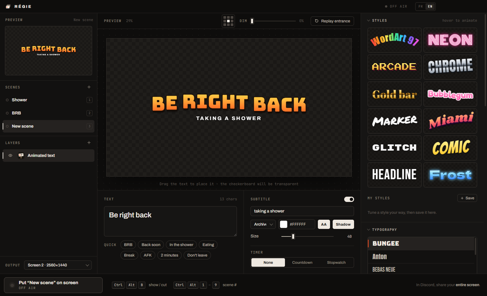
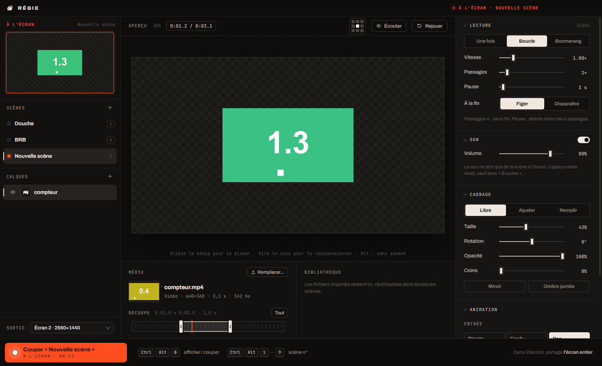
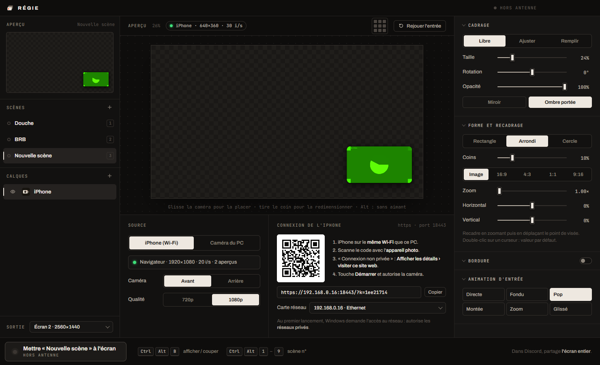

<div align="center">


# SceneCue

**Scene control for streaming on Discord.**
Animated text, images, GIFs, videos, camera (even your iPhone's) and the song playing on Spotify, shown on top of your screen,
on a transparent background, on demand or with a keyboard shortcut.

[**Download**](https://franckitho.github.io/scenecue/) · [Website](https://franckitho.github.io/scenecue/) · [Releases](https://github.com/franckitho/scenecue/releases)


</div>



## Why

When you share your screen on Discord, your friends see what you see and nothing more. No “Be right back” scene,
no timer, no camera overlay, unless you set up OBS and a virtual camera.

SceneCue does it right on your desktop. You prepare **scenes** (“BRB”, “In the shower”, “Eating”…),
then put one **on screen** in one click or with a shortcut. It shows on top of everything, on a transparent background,
and clicks go through it: you keep using your PC normally.
Share your **entire screen** in Discord and the scene is part of the stream.

## Features

- **Scenes and layers**: a scene stacks as many layers as you want. Drag to reorder, click the eye to hide a layer.
  A live preview shows the composed scene.
- **Instant on-screen switch**: a button or **Ctrl+Alt+B**, and **Ctrl+Alt+1…9** to call a scene by its number.
  Switching from one scene to another is animated.
- **Animated text**, WordArt style: 12 ready-made styles (neon, chrome, arcade, comic…), about thirty fonts,
  gradients, outline, 3D extrusion, curve, animations, timer or countdown, and a dim layer that darkens the screen.
- **Image / video**: PNG, JPG, GIF, WebP, APNG, SVG, MP4, WebM, MOV.
  Play *once*, *looped* or *boomerang*, with speed, trimming and sound.
- **Camera**: webcam or capture card, or **your iPhone's camera over Wi-Fi**, with no app to install.
  Round or circle shape, border, zoom and crop.
- **Now playing**: the song playing in **Spotify**, with its cover, title, artist and progress bar,
  updated by itself. No Spotify account to connect.
- **French or English interface**: SceneCue starts in English, and the **FR | EN** switch in the title bar changes it at any time.
- **Everything stays with you**: no account, no telemetry, no outside server.
  The iPhone's video only travels over your local network.
- **Extensible**: each kind of layer is a module (an HTML page and a `module.json`). See [Writing a module](#writing-a-module).

## Install

### With the executable

1. Download the latest version from the [**website**](https://franckitho.github.io/scenecue/) or the [**Releases**](https://github.com/franckitho/scenecue/releases/latest) page.
2. Unzip it anywhere and run **`SceneCue.exe`**.

Nothing is installed on the system. Settings live in `%APPDATA%\SceneCue`: delete that folder to start from scratch.
Used the app when it was called Régie? Your scenes, media library and camera settings are picked up from `%APPDATA%\Regie` on first launch.

> Windows SmartScreen may warn you on first launch because the executable is not signed: *More info › Run anyway*.

### From source

You need [Node.js](https://nodejs.org) 22.12 or newer.

```bash
git clone https://github.com/franckitho/scenecue.git
cd scenecue
npm install
cd cam && npm install && cd ..   # Camera module dependency (QR code)
npm start
```

## Usage

1. **Scenes**: `+` to create one, double-click to rename it. Their order gives the Ctrl+Alt+1…9 shortcuts.
2. **Layers**: `+` to add a module to the scene. The top layer is drawn over the others.
   Click a layer to edit it: the scene's other layers stay visible behind the preview.
3. **Put on screen** shows the selected scene. If another scene is already on screen, the button becomes **Switch to…**.
4. In Discord, share your **entire screen** (not a window) and pick the screen set as **Output** at the bottom left of SceneCue.

| Shortcut (anywhere) | Action |
|---|---|
| **Ctrl+Alt+B** | Show or cut the selected scene |
| **Ctrl+Alt+1** … **9** | Show scene # (or cut it if it is already on screen) |

If you close the window while a scene is on screen, SceneCue goes to the notification area.
Right-click its icon to switch scenes or quit.

## Modules

### Animated text

Type your message, pick a style from the gallery, then tune it: font, fill (solid, gradient, chrome, gold, rainbow),
outline, shadow or 3D extrusion, curve, tilt, animation (wave, bounce, neon, glitch, typewriter, marquee…) and entrance.
Drag the text in the preview to place it. Optional: a subtitle, a **countdown** or a **stopwatch**,
and a **dim layer** that darkens the whole screen behind the text. You can save your own styles.

This module also runs on its own, as **Pancarte**: see [text-animated/README.md](text-animated/README.md).

### Image / video



- **Drop a file** in the editor or click **Choose…**. It is copied into a **library**, reusable in every scene.
- **Playback** of videos and animated images:
  - *Once*, *Loop* or *Boomerang* (back and forth);
  - speed from 0.25× to 4×;
  - number of repeats and pause between two plays;
  - at the end, *Freeze* or *Disappear*.

  Still image: display duration.
- **Trim**: two handles to keep only a clip.
- **Sound**: only plays from the scene on screen. The preview stays muted, except with **Listen**.
- **Framing**: free (drag to place, corner to resize), fit or full screen.
  Rotation, opacity, rounded corners, mirror, drop shadow, entrance animation and continuous motion.

Boomerang keeps frames in memory: it is meant for short clips (under 10 s). It is always muted.

### Camera



**PC camera**: webcam, capture card or virtual camera. Pick the device, the resolution (720p to 4K) and 30 or 60 fps.

**iPhone over Wi-Fi**, with no app:

1. Put the iPhone and the PC on the **same network**.
2. Scan the **QR code** shown in the editor with the iPhone's Camera app.
3. Safari says “This Connection Is Not Private”. That's expected: Safari only allows the camera over HTTPS,
   and SceneCue creates its own certificate. Tap **Show Details › visit this website**.
4. Tap **Start** and allow the camera. Keep Safari in the foreground and the screen on.

Then:
- front or back camera and quality (720p or 1080p) can be changed from SceneCue or from the phone;
- the picture sent to the screen is full quality. SceneCue's previews get a small picture,
  and when off air the phone stops encoding the on-screen picture to save battery;
- the address contains a secret code: another device on the network can't send its video into your stream.

The phone page follows the phone's language (French or English).

### Now playing

Shows the song playing in the **Spotify desktop app**: cover, title, artist, album, progress bar and time.
There is nothing to connect: SceneCue reads it from Windows' media controls (the ones shown next to the volume).
The Spotify web player, in a browser, isn't supported.

- **Layout**: *Card* (cover on the left), *Compact* (a single line) or *Cover* (large cover, text below).
  Drag the card in the preview to place it, pull its corner to resize it. A title too long for the card scrolls.
- **Colors**: background and its opacity, text, and an accent (progress bar, equalizer) taken from the song's cover
  or chosen by you.
- **Paused**: the card stays, dims or leaves the screen until playback resumes.
- **New song**: instant, fade or slide transition.

While Spotify is closed, the editor's preview shows a sample song and the card stays off screen.

## Troubleshooting

| Problem | Solution |
|---|---|
| The scene doesn't show in the stream | Share your **entire screen** in Discord, not a window, and check the **Output** screen in SceneCue. |
| A game covers the scene | Switch the game to **borderless windowed**: exclusive fullscreen covers everything. |
| Ctrl+Alt+B does nothing | Another application already uses this shortcut (for example Pancarte, running at the same time): it then shows greyed out at the bottom of SceneCue's window. |
| The iPhone can't open the page | Same Wi-Fi on both sides. On first launch, Windows asks for network access: allow **private networks**. If your Wi-Fi profile is **public**, switch it to **private**. Several network adapters (VPN, WSL, virtual machines): pick the right one under **Network adapter**. |
| “Safari blocks the camera” | Use the `https://` address (the one in the QR code). The `http://…:8080` address redirects to it automatically. |
| The iPhone's picture freezes | iOS cuts the camera when Safari goes to the background or the screen locks. Come back to the page: it reconnects by itself. |
| “Camera already used” | Discord, OBS or Teams are using the webcam. Close them, then click **Retry**. |
| “Port 8443 is already used” | Another application uses this port. Change `port` in `%APPDATA%\SceneCue\modules\camera\config.json` and restart SceneCue. |
| Now playing says “Spotify isn't open” while music plays | Use the Spotify **desktop app**: the web player isn't supported. |

## Privacy

- SceneCue contacts no server: fonts and libraries are bundled, and there is no account, no auto-update, no analytics.
- The Camera module's server only starts when a layer uses the iPhone source. It listens on your local network
  (ports 8443 and 8080). Only a device that has the QR code's secret code can send its video to it.
  The video goes straight from the phone to the PC (WebRTC), without going through the Internet.
- Files imported into the library are copied to `%APPDATA%\SceneCue\media`. They never leave your PC.
- The Now playing module reads Windows' media controls locally, through Windows PowerShell running in the background.
  It only runs while a scene uses the module, and contacts neither Spotify nor any other server.

## Development

```bash
npm start                                      # SceneCue in development mode
npm run check                                  # syntax check of every JavaScript file
npm run package                                # builds dist/SceneCue-win32-x64/SceneCue.exe (close SceneCue first)
npm run site                                   # builds the website into _site/ (add -- --repo=owner/name for the links)
cd text-animated && npm install && npm start   # the Animated text module on its own (Pancarte)
```

Plain JavaScript, no framework, no build step: edit a file, restart `npm start`.
The interface is written in French; English translations live in each page's `en.js` (see [Translation](#translation)).
Code comments are in French.

### Layout

```
├─ src/              SceneCue: main process, window, compositor, overlay
├─ text-animated/    Animated text module (also runs on its own: Pancarte)
├─ media/            Image / video module
├─ cam/              Camera module (HTTPS server + page for the phone)
├─ music/            Now playing module (reads Spotify through Windows' media controls)
├─ site/             project website (GitHub Pages)
├─ scripts/          executable build, icons, website, test scenarios
├─ .github/          build, release and website pipelines
├─ MODULES.md        writing a module
└─ CLAUDE.md         detailed architecture and known pitfalls
```

Every page is served by an internal protocol (`scenecue://app`).
Each layer is an iframe of the same origin, which is how it gets its “bridge” to SceneCue.
The overlay is a transparent, always-on-top window that lets clicks through.
Details are in [CLAUDE.md](CLAUDE.md).

### Translation

French is the source language. Each page loads `i18n.js` (a small shared helper) and an `en.js` dictionary
mapping the French text to English. `I18N.apply()` translates the static HTML, and `_('French text', { var })`
the text built in JavaScript. To translate a new string, add it to the matching `en.js`;
`scripts/snap-i18n.js` reports any French text left in the English interface.

### Tests

No unit tests. **Scenarios** run the real application with a temporary profile, drive it,
take screenshots and check the result:

```bash
npx electron scripts/snap.js <folder>         # SceneCue: scenes, layers, putting on screen
npx electron scripts/snap-media.js <folder>   # Image / video: 31 checks (results.txt)
npx electron scripts/snap-cam.js <folder>     # Camera: 27 checks, with a simulated iPhone
npx electron scripts/snap-music.js <folder>   # Now playing: 36 checks, with a simulated Spotify
npx electron scripts/snap-i18n.js <folder>    # English interface: no French left, switch back to French
```

Each takes about a minute and opens windows. They are muted, and the camera scenarios use Chromium's fake camera:
your webcam is never opened, and the Now playing scenario never controls your Spotify. To test the built executable, add
`SCENECUE_MAIN="C:/path/dist/SceneCue-win32-x64/resources/app.asar/src/main.js"`.

### Releases and website

Two GitHub Actions pipelines live in [.github/workflows](.github/workflows):

- **Build** (`build.yml`) builds `SceneCue.exe` on Windows for every push to `main` and every pull request.
  The zip can be downloaded for 14 days from the run's *Artifacts*.
- **Publish a release**: push a tag starting with `v`. The same pipeline builds the executable with that version number
  and creates a GitHub release with `SceneCue-win-x64.zip`:

  ```bash
  git tag v1.0.0
  git push origin v1.0.0
  ```

  The file name never changes, so `releases/latest/download/SceneCue-win-x64.zip` always downloads the latest version.
- **Website** (`pages.yml`) publishes `site/` to GitHub Pages on every change. Enable it once in
  *Settings › Pages › Build and deployment › Source: GitHub Actions*. The website's download button reads
  the latest release when the page loads: publishing a version doesn't require redeploying the site.

### Writing a module

A module is a folder with a `module.json`: two HTML pages (the editor and the on-screen render),
and optionally a Node script (`main`) for what needs the system (server, files…).
SceneCue detects it at startup and adds it to the catalog.

```json
{
  "id": "my-module",
  "name": "Mon module",
  "description": "Une phrase pour le catalogue.",
  "en": { "name": "My module", "description": "A sentence for the catalog." },
  "icon": "assets/icon.png",
  "panel": "src/renderer/index.html",
  "layer": "src/renderer/layer.html"
}
```

The full contract (bridge, events, media library, backend, translation) is in [MODULES.md](MODULES.md).
The bundled modules are examples; [cam](cam/) and [music](music/) also show a Node backend.

## Contributing

Contributions are welcome: new modules, fixes, ideas.

- Keep the existing style: plain JavaScript, no dependency when possible, no build step.
- Interface text is written in French with its English translation in `en.js`.
- Run the relevant test scenarios before proposing a change, and attach a screenshot if the interface changes.
- A new module must stay self-contained in its folder.

## Known limitations

- **Windows only** for now: global shortcuts, the overlay and the build target Windows 10 and 11.
- Interface in French and English only.
- The iPhone camera depends on Safari: screen on and page in the foreground while streaming.

## Credits

- [Electron](https://www.electronjs.org)
- Fonts from [Fontsource](https://fontsource.org), under the SIL Open Font License
- [node-qrcode](https://github.com/soldair/node-qrcode) for the Camera module's QR code

## License

[MIT](LICENSE)
